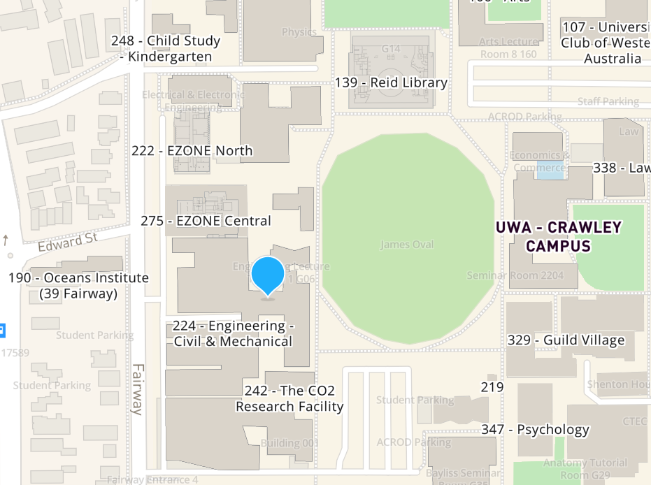

# MLBE IoT Crash Course

## Welcome
Welcome to the MLBE Internet of Things Crash Course!

## Details
### When
The course will run for 4 days between 9th December and 14th December. Arrive at 8:45am for a 9:00am start and finishing at 12:30pm. 

### Where
The System Health Lab is located on the 1st Floor  of the Civil and Mechanical Engineering Building (224, indicated on campus map). Enter the building on the east side (adjacent to James Oval) and go up the stairs, then go down the hallway where you will find the lab indicated by a sign on the wall. If you get lost, call Melinda on (phone number).

### What to Bring
Participants must bring a laptop and charger. Afternoon tea will be provided.

## Prior to the Course
1. Join the course's Team
2. Create a [Github](https://github.com/) account
3. Post your Github username on the Teams channel
4. Download and install the [Arduino IDE](https://www.arduino.cc/en/software).
5. Open the Arduino IDE and go to File > Preferences. Copy and paste https://dl.espressif.com/dl/package_esp32_index.json,http://downloads.arduino.cc/packages/package_arduino.cc_linux_index.json into the 'Additional Board Manager URLs', then press OK.
6. Go to Tools > Board: "..." > Boards Manager and press install 'esp32'.

## On the Day
All participants will be required to complete a safety induction on the morning of the first day of the course.
